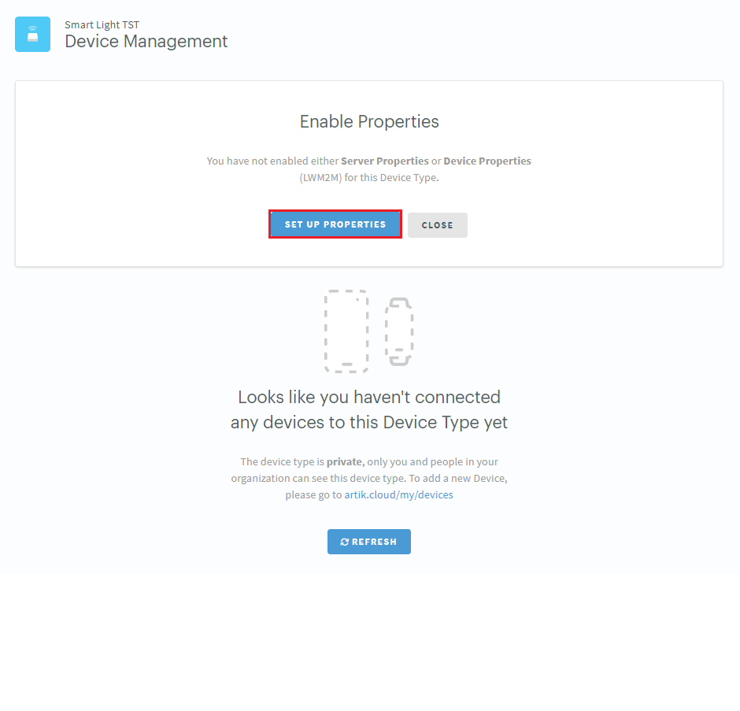

# Smart Lighting Control with ARTIK 055s

This application is to use ARTIK 055s to implement smart dimmable light.  The smart light application can be used with Samsung ARTIK mobile app to turned on, turn off the LED light and/or adjusting brightness of the LED light.  A physical on device button is also provided for as a traditional way of controlling the LED light.  By using Samsung ARTIK mobile app, users can easily onboard the smart light onto ARTIK Cloud.  Over the air firmware update (OTA) capability is included in the smart light application as well.

## Contents

> * [How to Application Download](#how-to-application-download)
> * [Prepare Hardware](#prepare-hardware)
> * [About Smart Light application](#about-smart-light-application)
> * [Build Application](#build-application)
> * [Program Binary](#program-binary)
> * [ARTIK Cloud Setup](#artik-cloud-setup)
> * [Run Smart Light application](#run-smart-light-application)
> * [Generate OTA Image](#generate-ota-image)

## How to Application Download

```bash
$ git clone --recursive https://github.com/SamsungARTIK/TizenRT.git
$ cd TizenRT
$ git checkout 39c00d1ee3d2781c9f78f46bd840dce4ef6e1db4
$ git clone https://github.com/JunhwanPark/AppNotes-SmartLight ./apps/examples/smart_light
```

## Prepare Hardware

Connect LED to ARTIK 055s starter kit as shown below:

The ARTIK 055s starter kit pinout map is listed [here](../../../build/configs/artik055s/README.md#artik055s-starter-kit-pinout).

The smart light application has already pre-programmed to connect to **XPWMTOUT_3** pin.  We are using pulse width modulation (PWM) to drive LED in this application.  This means that LED is getting switched on and off.  When the switching frequency is higher enough, the brightness of the LED is integrated over time, and human eyes cannot tell the difference.  We are setting the switching frequency of LED to be **1000Hz** in the code.  This means that the LED is turned on for 0.1 millisecond then turned off for another 0.9 millisecond.

When powering up LED, it’s always a good practice to connect resistor to LED.  The resistor (100 ohm) is used to limit the current though the LED and prevent it burns.

Please note that the LED cathode (-) pin is the pin that right next to the flat spot of the LED, which connects to the ground.  The anode (+) is the other pin that connects to the resistor and **XPWMTOUT_3** pin.


## About Smart Light Application

There are 5 pre-set brightness levels that can be used to control the brightness of LED light, they are:


|   Control Action  |   Brightness Level (%)    |
|:------------------|:-------------------------:|
|SetOn              |   100%                    |
|SetReading         |   80%                     |
|SetMovie           |   35%                     |
|SetSleep           |   8%                      |
|SetOff             |   0%                      |

The above 5 brightness settings can be used both locally by pressing physical button (**SW703** on starter kit), and remotely by selecting the particular action using mobile app through ARTIK Cloud.

There is an additional remote action that can be supported by using mobile app.  This remote action is called **SetBrightness**.  It can be used to remotely adjusting LED brightness to any preferable  brightness level between 0% to 100%.

Once the ARTIK 055s powered smart light device is powered up and connected to Wi-Fi and ARTIK Cloud through the build-in onboarding process, the smart LED light is ready to use.


## Build Application
Refer [here](../../../README.md#ubuntu-development-setting) to setup development environment.
```bash
$ cd os
$ ./tools/configure.sh artik055s/typical
$ make
```
The **smartlight** is included in the build by default

## Program Binary
```bash
$ make download ALL
```

## ARTIK Cloud Setup
Follow [ARTIK Cloud Getting Started](https://developer.artik.cloud/documentation/getting-started/hello-world.html) page to register and log into your ARTIK Cloud account.

When creating new device type under your ARTIK Cloud, you can use the pre-defined [manifest.json](Manifest/com.smart.light.manifest.json) to create your smart light device by drag and drop the json file in the upload block like shown below.


After creating the device, the other thing you need to do is to browse to **Device Management** tab under your newly created device, then click **SET UP PROPERTIES** to enable server properties and device properties and allow LWM2M running for your device.



## Run Smart Light application
Now we are ready to run the application.
```bash
TASH>> smartlight
```
Then please refer to [artik.io](https://developer.artik.io/documentation/artik-05x/getting-started/communicate.html#auto-connect-artik-05x-to-wi-fi-and-artik-cloud) to:
* Download mobile app
* Provision Wi-Fi to your smart light device
* Onboard smart light device onto ARTIK Cloud

After successfully onboarding the smart light, you should be able to see the device under your ARTIK Cloud account.


If you click on the device, all of the actions defined in the device manifest file will be shown.


All of the action, except **SetBrightness** do not require additional setup.  As mentioned in [previous section](#about-smart-light-application), the brightness level can be set between 0% to 100%.  To set the preferred brightness level, click on **SetBrightness** action from the mobile app device action list, then type in integer between 0 to 100 in the text field below.


## Generate OTA Image
```bash
$ make image ota
```
Note: The resulting "ota.bin" can be found under **/build/configs/$(BOARD_NAME)/bin**
This image can be used to upload into [ARTIK Cloud](https://developer.artik.cloud/documentation/device-management/ota-updates.html) for OTA update under device management.


Enjoy!

